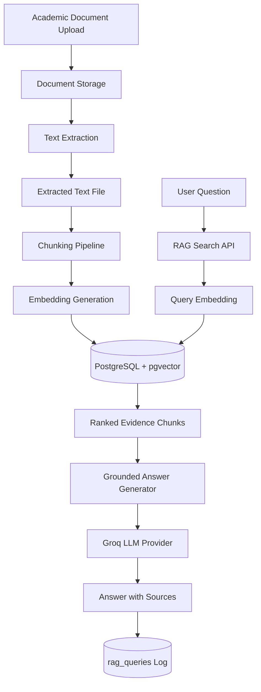
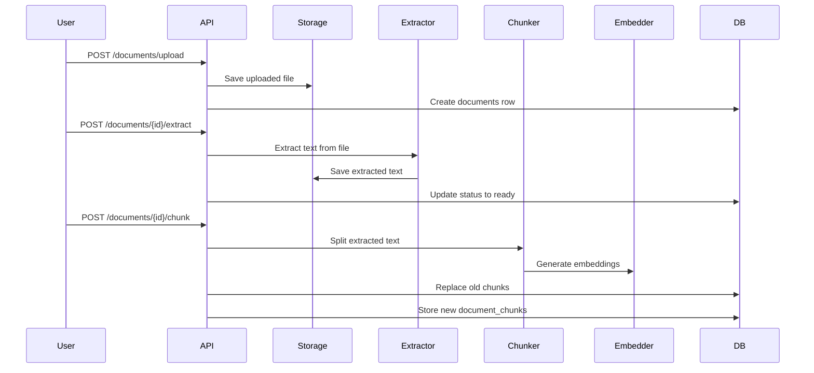
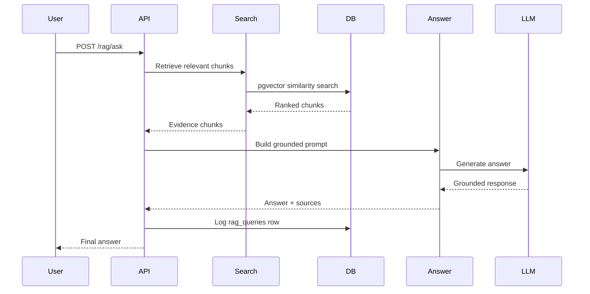

# uniAdvisor Backend

uniAdvisor is a production-style academic advising RAG system.

The goal of the project is to help students and advisors ask questions about academic documents such as course catalogs, four-year plans, major checksheets, degree audits, and degree requirement documents.

Phase 1 focuses on the RAG foundation for uploaded Computer Science advising documents and now includes a local Advisor Console and Student View in the frontend.

It supports:

* Document upload
* Text extraction
* Chunking
* Embedding generation
* pgvector-based semantic search
* Grounded answer generation
* Source references
* Refusal handling for unsupported academic decisions
* RAG query logging

Phase 1 does not include authentication, transcript access, prerequisite tools, official degree-audit logic, semester planning, or multi-tool agents yet.

---

## Project Purpose

Academic advising information is often spread across multiple PDFs, catalogs, plans, and requirement sheets. uniAdvisor is designed to make those documents searchable and easier to understand through a grounded RAG workflow.

The system is intentionally designed as more than a simple chatbot. It separates document storage, text extraction, chunking, embeddings, retrieval, answer generation, and safety behavior into clear backend services.

---

## Phase 1 Scope

### In Scope

* Computer Science department documents only
* Local document storage by default, with optional Supabase Storage for deployment
* PDF, TXT, and Markdown upload
* Text extraction
* Document chunking
* Embeddings using `sentence-transformers/all-MiniLM-L6-v2`
* PostgreSQL + pgvector storage
* Semantic search over document chunks
* Groq-backed grounded answer generation
* Source references
* Query logging
* Refusal behavior for weak or unsafe questions
* Backend tests

### Out of Scope

* User authentication
* Transcript access
* Student profiles
* Personalized degree audits
* Prerequisite checking
* Semester planning
* Course registration logic
* Multi-tool agents
* Advisor approval workflow

---

## Architecture Overview



---

## Backend Flow

The Phase 1 backend follows this flow:

```text
upload document
→ extract text
→ chunk text
→ generate embeddings
→ store chunks in pgvector
→ search chunks
→ generate grounded answer
→ return sources
→ log query
```

---

## Document Processing Pipeline



---

## RAG Answer Flow



---

## Tech Stack

* Python
* FastAPI
* SQLAlchemy
* Alembic
* PostgreSQL
* pgvector
* pypdf
* sentence-transformers
* Groq API
* Optional Supabase Storage
* pytest

---

## Backend Services
All commands below assume you are running them from the project root.

```text
backend/app/api/documents.py        Document upload, extraction, and chunking routes
backend/app/api/rag.py              RAG search and ask routes

backend/app/services/document_storage.py
backend/app/services/text_extraction.py
backend/app/services/chunking.py
backend/app/services/embeddings.py
backend/app/services/rag_search.py
backend/app/services/rag_answer.py
backend/app/services/llm.py

backend/app/db/models.py            SQLAlchemy models
backend/app/db/types.py             pgvector SQLAlchemy type
backend/app/db/session.py           Database session helpers
backend/app/core/config.py          App configuration
```

---

## Database Overview

Phase 1 uses PostgreSQL with pgvector.

Core tables:

```text
documents
document_chunks
rag_queries
rag_feedback
```

### documents

Stores uploaded academic source file metadata.

Examples:

* Course catalog
* Four-year plan
* Major checksheet
* Degree audit
* Degree requirements

### document_chunks

Stores searchable text chunks and embeddings.

Each chunk includes:

* text
* embedding
* page number
* section title
* source type
* department
* program
* academic year
* content hash

### rag_queries

Stores user questions, answers, retrieved chunk IDs, confidence, source count, and refusal information.

### rag_feedback

Stores optional feedback on generated answers.

---

## API Endpoints

### Document APIs

```http
POST /documents/upload
POST /documents/{document_id}/extract
POST /documents/{document_id}/chunk
```

### RAG APIs

```http
POST /rag/search
POST /rag/ask
```

---

## Example Workflow

### 1. Upload a document

```http
POST /documents/upload
```

Supported file types:

```text
.pdf
.txt
.md
```

Required metadata:

```text
title
source_type
file
```

Optional metadata:

```text
department
program
academic_year
```

Defaults:

```text
department = Computer Science
program = Computer Science
```

---

### 2. Extract text

```http
POST /documents/{document_id}/extract
```

This extracts readable text and stores it through the configured storage provider.

---

### 3. Chunk and embed

```http
POST /documents/{document_id}/chunk
```

This creates ordered chunks, generates content hashes, creates 384-dimensional embeddings, and stores rows in `document_chunks`.

---

### 4. Search chunks

```http
POST /rag/search
```

Example request:

```json
{
  "query": "What math courses are required for the Computer Science major?",
  "filters": {
    "department": "Computer Science",
    "program": "Computer Science"
  },
  "top_k": 5
}
```

---

### 5. Ask a grounded question

```http
POST /rag/ask
```

Example request:

```json
{
  "question": "What math courses are required for the Computer Science major?",
  "filters": {
    "department": "Computer Science",
    "program": "Computer Science"
  },
  "top_k": 5
}
```

The response includes:

* grounded answer
* confidence
* refusal status
* source references
* advisor note
* query log entry

---

## Grounding and Safety Behavior

uniAdvisor is designed to avoid unsupported academic claims.

The system refuses or qualifies answers when:

* No relevant chunks are found
* Retrieved chunks are weak or empty
* The question asks for official graduation eligibility
* The question asks for personalized degree-audit decisions
* The answer cannot be supported by uploaded documents

Example refused behavior:

```text
I cannot determine graduation eligibility from the uploaded documents alone. I can explain the listed Computer Science requirements, but official degree progress requires advisor or registrar review.
```

---

## Environment Variables

Create a `.env` file based on `.env.example`.

Common settings include:

```text
COURSECOMPASS_DATABASE_URL=
GROQ_API_KEY=
COURSECOMPASS_GROQ_MODEL=
STORAGE_PROVIDER=local
COURSECOMPASS_DOCUMENT_STORAGE_DIR=
COURSECOMPASS_EXTRACTED_TEXT_DIR=
SUPABASE_URL=
SUPABASE_SERVICE_ROLE_KEY=
SUPABASE_STORAGE_BUCKET=uniadvisor-documents
COURSECOMPASS_ALLOWED_UPLOAD_EXTENSIONS=
COURSECOMPASS_CHUNK_SIZE=
COURSECOMPASS_CHUNK_OVERLAP=
COURSECOMPASS_CORS_ORIGINS=
```

`STORAGE_PROVIDER` defaults to `local`. Use local storage for development unless you are testing deployment-like persistence. `COURSECOMPASS_STORAGE_PROVIDER` is also accepted as a project-prefixed alias.

For Supabase Storage, set:

```text
STORAGE_PROVIDER=supabase
SUPABASE_URL=https://<project-ref>.supabase.co
SUPABASE_SERVICE_ROLE_KEY=<backend-only-service-role-key>
SUPABASE_STORAGE_BUCKET=uniadvisor-documents
```

`SUPABASE_SERVICE_ROLE_KEY` is backend-only and must never be exposed to frontend code, committed to the repo, or added to any `NEXT_PUBLIC_*` variable.

Supabase Storage uses one private bucket named `uniadvisor-documents`. Object paths are:

```text
uploads/{document_id}/{safe_filename}
extracted/{document_id}.txt
```

When `STORAGE_PROVIDER=supabase`, `documents.file_path` stores the uploaded object path such as `uploads/<document_id>/major-checksheet.pdf`. Search and Ask still use database chunks and do not read files from storage.

Manual Supabase setup:

1. Open the Supabase project.
2. Create a Storage bucket named `uniadvisor-documents`.
3. Keep the bucket private.
4. Copy the project URL into backend `SUPABASE_URL`.
5. Copy the service role key into backend `SUPABASE_SERVICE_ROLE_KEY` only.
6. Set `STORAGE_PROVIDER=supabase` in the backend deployment environment.

No frontend Supabase configuration is required for this phase.

---

## Running Locally

Install dependencies:

```bash
.venv/bin/python -m pip install -e '.[dev]'
```

Run database migrations:

```bash
.venv/bin/python -m alembic upgrade head
```

Start the API:

```bash
.venv/bin/python -m uvicorn backend.app.main:app --reload
```

API docs should be available at:

```text
http://localhost:8000/docs
```

---

## Running Tests

Run all tests:

```bash
.venv/bin/python -m pytest
```

Compile backend code:

```bash
.venv/bin/python -m compileall backend
```

Expected validation after Phase 1 hardening:

```text
pytest passes
compileall backend passes
```

Some tests may skip if the real local embedding model is unavailable. Unit and workflow tests use overrides so they do not require a live Groq key or external network access.

---

## Phase 1 Test Coverage

The backend includes tests for:

* Data model schema
* Document upload
* Text extraction
* Chunking and embeddings
* RAG search
* Grounded answer generation
* Refusal behavior
* RAG query logging
* Full Phase 1 workflow

The full workflow test covers:

```text
upload
→ extract
→ chunk
→ search
→ ask
→ verify sources
→ verify rag_queries log
```

---

## Current Development Status

Completed Phase 1 milestones:

* Data model foundation
* Document upload and text extraction
* Chunking and embedding pipeline
* RAG search
* Grounded answer generation
* Backend-derived confidence score
* Advisor Console and Student View integration
* Phase 1 hardening and code quality pass

Future backend phases may include:

* Course lookup tools
* Prerequisite checker
* Degree requirement checker
* Student profile support
* Semester planner
* Multi-tool advising agent
* Advisor review workflow

---

## Design Principle

Build reliable retrieval before adding autonomy.

uniAdvisor Phase 1 intentionally focuses on grounded document understanding before adding tools, agents, or personalized academic planning.
